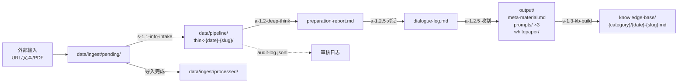
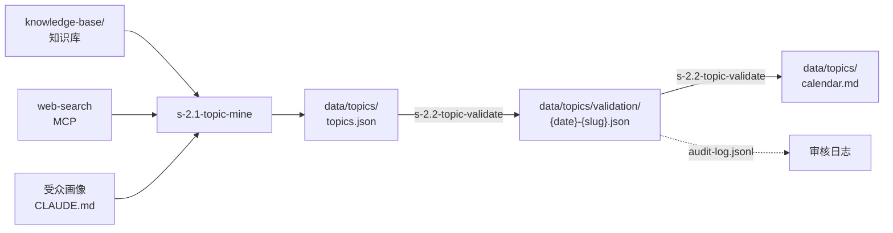
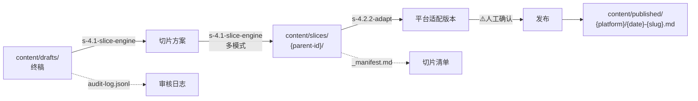
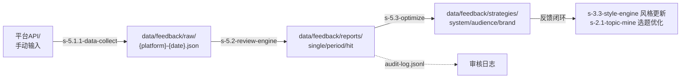

# 项目目录蓝图 · DIRECTORY-MAP

> 版本：V2.0 | 更新日期：2026-04-22
> V2.0 重大变更：移除 Context Snapshot 机制，改为三层数据传递协议；新增审核日志系统

---

## 目录结构（完整版）

```
ProjectFilesV1.1/
├── CLAUDE.md                              # L0 系统入口·中枢调度配置
├── .claude/commands/                      # Slash Commands 定义
│   ├── learn.md
│   ├── think.md
│   ├── analyze.md
│   ├── topic-mine.md
│   ├── validate.md
│   ├── create.md
│   ├── full-pipeline.md
│   ├── quick-create.md
│   ├── distribute.md
│   ├── review.md
│   └── style-learn.md
│
├── docs/                                  # L1 项目文档
│   ├── DIRECTORY-MAP.md                  #   本文件·目录蓝图+文件生命周期
│   ├── SKILL-INDEX.md                    #   全Skill统一索引（V2.0: 20个核心Skill）
│   ├── MIGRATION-V2.md                   #   V2.0 迁移指南
│   ├── USER-GUIDE.md                     #   功能操作说明书
│   └── CHANGELOG.md                      #   更新日志
│
├── skills/                                # Skill 文件库（只读参考，不产生数据文件）
│   ├── m1-knowledge/                     #   M1 知识积累（4个核心Skill）
│   ├── m2-topic/                         #   M2 选题策划（2个核心Skill）
│   ├── m3-creation/                      #   M3 内容创作（7个Skill）
│   ├── m4-distribution/                  #   M4 多平台分发（3个核心Skill）
│   ├── m5-feedback/                      #   M5 数据反馈（3个核心Skill）
│   ├── _archived/                        #   V1.1 归档文件（34个）
│   └── external/skills/                  #   Anthropic 官方扩展技能库
│
├── knowledge-base/                        # 知识库（M1 产出的长期知识资产）
│   ├── _index.md                         #   L2 知识库总索引
│   ├── _graph.json                       #   知识图谱（V2.0）
│   ├── technology/                       #   技术类
│   ├── mindset/                          #   认知类
│   ├── business/                         #   商业类
│   ├── growth/                           #   成长类
│   └── viewpoint/                        #   观点类
│
├── content/                               # 内容库（M3→M4 的创作产物）
│   ├── _content-map.json                 #   内容体系地图（s-3.1.1 产出/维护）
│   ├── _index.md                         #   L2 内容库总索引
│   ├── drafts/                           #   草稿
│   │   └── {YYYYMMDD}-{slug}.md
│   ├── published/                        #   已发布（按平台归档）
│   │   ├── wechat/                       #     公众号
│   │   ├── xiaohongshu/                  #     小红书
│   │   ├── zhihu/                        #     知乎
│   │   ├── bilibili/                     #     B站
│   │   ├── douyin/                       #     抖音
│   │   └── podcast/                      #     播客
│   └── slices/                           #   内容切片（M4 产出）
│       └── {parent-id}/                  #     按母稿ID归档
│           ├── _manifest.md              #       L3 单批切片清单
│           └── slice-{NNN}-{platform}-{type}.md
│
├── data/                                  # 数据层（所有模块的过程数据）
│   │
│   ├── ── ingest/                        # ★ 外部素材导入暂存区
│   │   ├── _index.md                     #   L2 导入记录索引
│   │   ├── pending/                      #   待处理（用户拖入/上传的原始文件）
│   │   └── processed/                    #   已处理（已分发到下游目录的文件记录）
│   │
│   ├── ── pipeline/                      # ★ 流程中间数据（M1/M3 全流程）
│   │   ├── _index.md                     #   L2 会话历史索引
│   │   │
│   │   ├── think-{YYYYMMDD}-{slug}/     #   M1 思考会话 (/think)
│   │   │   ├── _manifest.md              #     L3 会话产物清单
│   │   │   ├── audit-log.jsonl           #     V2.0 审核日志
│   │   │   ├── preparation-report.md     #     P1-P4 合并准备报告
│   │   │   ├── dialogue-log.md           #     深度对话记录
│   │   │   └── output/                   #     最终输出
│   │   │       ├── meta-material.md      #       元素材
│   │   │       ├── prompts/              #       延展提示词 ×3
│   │   │       │   └── extend-{NN}-{slug}.md
│   │   │       └── whitepaper/           #       白皮书
│   │   │           ├── outline.md        #         大纲
│   │   │           └── chapter-{NN}-{slug}.md
│   │   │
│   │   ├── analyze-{YYYYMMDD}-{slug}/  #   A1.4 哲学分析会话 (/analyze)
│   │   │   ├── _manifest.md            #     产物清单
│   │   │   ├── audit-log.jsonl         #     V2.0 审核日志
│   │   │   ├── analysis-report.md      #     五阶分析报告
│   │   │   └── insights.md             #     涌现洞察
│   │   │
│   │   └── create-{YYYYMMDD}-{slug}/    #   M3 创作会话 (/create)
│   │       ├── _manifest.md              #     L3 创作产物清单
│   │       ├── audit-log.jsonl           #     V2.0 审核日志
│   │       ├── research.json             #     s-3.2.1 素材包
│   │       ├── outline.yaml              #     a-3.2.2 大纲（含 information_hierarchy）
│   │       ├── draft-v1.md               #     a-3.2.3 初稿
│   │       ├── iterate-report.yaml       #     a-3.2.4 迭代报告（5轮记录）
│   │       ├── style-check-report.json   #     s-3.3-style-engine 风格校验报告
│   │       ├── fact-check-report.json    #     s-3.4.1 事实核查报告
│   │       ├── seo-meta.json             #     s-3.2.5 SEO 元数据
│   │       └── final.md                  #     终稿 → 接入 content/drafts/
│   │
│   ├── ── topics/                        # ★ 选题数据（M2 产出）
│   │   ├── topics.json                   #   选题池（s-2.1-topic-mine 产出）
│   │   ├── validation/                   #   选题验证记录
│   │   │   └── {YYYYMMDD}-{slug}.json   #     s-2.2-topic-validate 评分 + 竞品
│   │   └── calendar.md                   #   内容日历（s-2.2-topic-validate 产出）
│   │
│   ├── ── style-profiles/                # ★ 风格档案（M3.3 产出）
│   │   ├── personal.json                 #   个人风格画像（s-3.3-style-engine 维护）
│   │   └── references/                   #   参考创作者风格
│   │       └── {creator-slug}.json       #     s-3.3-style-engine 产出
│   │
│   ├── ── style-guides/                  # ★ 项目级风格指南
│   │   └── {project-slug}.yaml           #   s-3.3-style-engine project_overlay 消费
│   │
│   ├── ── feedback/                      # ★ 数据反馈（M5 产出）
│   │   ├── raw/                          #   原始平台数据
│   │   │   └── {platform}-{YYYYMMDD}.json
│   │   ├── reports/                      #   分析报告
│   │   │   ├── single-{content-id}.json  #     s-5.2-review-engine 单篇复盘
│   │   │   ├── period-{period}.json      #     s-5.2-review-engine 周期分析
│   │   │   └── hit-patterns.json         #     s-5.2-review-engine 爆款模式
│   │   ├── insights/                     #   用户洞察（V2.0）
│   │   │   └── {date}-insights.json      #     s-4.3-engagement 用户洞察
│   │   └── strategies/                   #   策略建议
│   │       ├── system-optimize.json      #     s-5.3-optimize 系统优化
│   │       ├── audience-update.json      #     s-5.3-optimize 受众更新
│   │       └── brand-health.json         #     s-5.3-optimize 品牌健康
│   │
│   ├── ── audience/                      # ★ 受众画像（V2.0 新增）
│   │   └── audience-profile-v{N}.json    #   s-5.3-optimize 受众更新
│   │
│   ├── ── brand/                         # ★ 品牌健康（V2.0 新增）
│   │   └── brand-health-{date}.json      #   s-5.3-optimize 品牌健康
│   │
│   ├── ── optimization/                  # ★ 优化记录（V2.0 新增）
│   │   └── system-{date}.json            #   s-5.3-optimize 系统优化
│   │
│   └── ── logs/                          # 错误日志
│       └── error_log.jsonl
│
├── scripts/                               # Python 脚本工具
│   ├── _index.md                         #   L2 脚本工具索引
│   ├── learning-tracker.py              #   学习追踪（V2.0 从 Skill 降级）
│   ├── tag-assigner.py
│   ├── topic-pool-manager.py
│   ├── publish-checklist-gen.py
│   └── data-normalizer.py
│
└── mcp-servers/                           # MCP Server
    ├── knowledge-db/                     #   向量检索
    └── data-analysis/                    #   运营数据
```

---

## V2.0 数据传递协议（三层架构）

### 层级 1：模块内传递（完整数据）

**原则**：模块内 Skill 之间传递完整数据文件，通过文件路径引用。

**示例**：
```yaml
# M3 创作流程
s-3.2.1-research → research.json
  ↓ (文件路径传递)
a-3.2.2-outline 读取 research.json → outline.yaml
  ↓ (文件路径传递)
a-3.2.3-draft 读取 outline.yaml + research.json → draft-v1.md
```

### 层级 2：模块间传递（索引文件）

**原则**：模块间通过 `_manifest.md` 索引文件传递，包含关键元数据和文件路径。

**_manifest.md 格式**：
```markdown
# 任务产物清单

## 任务信息
- Task ID: create-20260422-001
- 模块: M3 内容创作
- 状态: completed
- 创建时间: 2026-04-22T10:30:00Z

## 产出文件
- 素材包: research.json
- 大纲: outline.yaml
- 初稿: draft-v1.md
- 终稿: final.md

## 关键元数据
- 标题: AI Agent 架构设计
- 字数: 3500
- 质量分: 8.5/10
- 风格检查: 通过
- 事实核查: 通过

## 下游访问
- M4 分发: 读取 final.md
- M5 反馈: 读取 _manifest.md 获取元数据
```

### 层级 3：长文档生成（分段加载）

**原则**：对于超长文档（如白皮书），采用逐章生成和加载策略。

**示例**：
```
whitepaper/
├── outline.md          # 大纲（全局结构）
├── chapter-01-intro.md # 第1章
├── chapter-02-core.md  # 第2章
└── chapter-03-impl.md  # 第3章

# 生成时：逐章生成，每章独立文件
# 加载时：按需加载特定章节
```

---

## 审核日志系统（V2.0 新增）

### audit-log.jsonl 格式

每个任务目录下都有 `audit-log.jsonl` 文件，记录所有自动决策：

```jsonl
{"timestamp":"2026-04-22T10:30:00Z","decision_point":"topic_scoring","auto_decision":"continue","score":6.8,"threshold":7.0,"reason":"score below threshold but within acceptable range"}
{"timestamp":"2026-04-22T10:35:00Z","decision_point":"fact_check","auto_decision":"flag_for_review","score":6.5,"issues_count":3,"reason":"fact check score below 7.0, flagged 3 issues"}
{"timestamp":"2026-04-22T10:40:00Z","decision_point":"style_check","auto_decision":"auto_fix","fixes_count":5,"reason":"auto-fixed 5 style issues"}
```

### 决策点类型

| 决策点 | 说明 | 可能的决策 |
|--------|------|-----------|
| `quality_check` | 内容质量检查 | continue / flag_for_review |
| `topic_scoring` | 选题评分 | continue / flag_low_score |
| `fact_check` | 事实核查 | continue / flag_for_review |
| `style_check` | 风格检查 | continue / auto_fix / flag_for_review |
| `kb_entry` | 知识库入库 | create / skip |
| `slice_strategy` | 切片策略 | execute / adjust |

### 查看审核日志

```bash
# 查看特定任务的日志
cat data/pipeline/{task_id}/audit-log.jsonl

# 查看所有低分选题
grep "topic_scoring" data/pipeline/*/audit-log.jsonl | grep "score.*6\."

# 查看所有需要人工审核的决策
grep "flag_for_review" data/pipeline/*/audit-log.jsonl
```

---

## 各模块文件生命周期映射

### M1 · 知识积累



| 触发命令 | 产出文件 | 归档位置 | V2.0 变更 |
|:---|:---|:---|:---|
| `/learn <input>` | 知识条目 | `knowledge-base/{category}/` | 新增 audit-log.jsonl |
| `/think <input>` | 准备报告 + 对话记录 + 元素材 + 提示词×3 + 白皮书 | `data/pipeline/think-{date}/` | 新增 _manifest.md |
| `/analyze <input>` | 五阶分析报告 + 涌现洞察 | `data/pipeline/analyze-{date}/` | 新增 audit-log.jsonl |

---

### M2 · 选题策划



| 触发命令 | 产出文件 | 归档位置 | V2.0 变更 |
|:---|:---|:---|:---|
| `/topic-mine` | 选题池更新 | `data/topics/topics.json` | 使用合并 Skill |
| `/validate <topic>` | 评分报告 + 竞品分析 + 日历 | `data/topics/validation/` | 新增 audit-log.jsonl |

---

### M3 · 内容创作

```mermaid
flowchart LR
    A["data/topics/<br>calendar.md"] -->|选题确认| B["data/pipeline/<br>create-{date}-{slug}/"]
    B -->|"s-3.2.1"| C["research.json"]
    C -->|"a-3.2.2"| D["outline.yaml"]
    D -->|"⚠️人工确认"| E["a-3.2.3"]
    E --> F["draft-v1.md"]
    F -->|"a-3.2.4<br>5轮迭代"| G["iterate-report.yaml"]
    G -->|"s-3.3-style-engine"| H["style-check-report.json"]
    H -->|"s-3.4.1"| I["fact-check-report.json"]
    I -->|"s-3.2.5"| J["seo-meta.json"]
    J --> K["final.md"]
    K -->|"⚠️人工确认"| L["content/drafts/<br>{date}-{slug}.md"]
    B -.->|"audit-log.jsonl"| M["审核日志"]
```



| 触发命令 | 产出文件 | 归档位置 | V2.0 变更 |
|:---|:---|:---|:---|
| `/create <topic>` | 素材包 + 大纲 + 初稿 + 迭代报告 + 风格报告 + 事实报告 + SEO + 终稿 | `data/pipeline/create-{date}/` | 新增 audit-log.jsonl + _manifest.md |
| 终稿确认 | 草稿文件 | `content/drafts/` | 审核节点减少 |
| `/style-learn` | 创作者风格画像 | `data/style-profiles/references/` | 使用合并 Skill |

---

### M4 · 多平台分发



| 触发命令 | 产出文件 | 归档位置 | V2.0 变更 |
|:---|:---|:---|:---|
| `/distribute <content>` | 切片清单 + 各平台切片 | `content/slices/{parent-id}/` | 移除切片预览确认 |
| 发布后 | 已发布内容副本（含平台元数据） | `content/published/{platform}/` | 新增 audit-log.jsonl |

---

### M5 · 数据反馈



| 触发命令 | 产出文件 | 归档位置 | V2.0 变更 |
|:---|:---|:---|:---|
| `/review <period>` | 原始数据 + 单篇/周期报告 + 爆款模式 + 策略建议 | `data/feedback/` 三级子目录 | 使用合并 Skill |

---

## 外部素材导入规范（Import Protocol）

### 导入暂存区 `data/ingest/`

```
data/ingest/
├── _index.md                    # 导入记录（每次导入一行）
├── pending/                     # 待处理
│   ├── 2026-04-22-report.pdf   # 用户放入的原始文件
│   └── 2026-04-22-video.txt    # 视频字幕文本
└── processed/                   # 已处理
    └── 2026-04-22-report.log   # 处理日志（分发到了哪里）
```

### 导入流程

| 步骤 | 操作 | 输出 | V2.0 变更 |
|:---|:---|:---|:---|
| 1. 放入 | 用户将文件拖入 `data/ingest/pending/` 或通过 `/learn` 提供 URL | 原始文件 | - |
| 2. 识别 | `s-1.1-info-intake` 识别文件类型（PDF/URL/文本/视频字幕） | 类型标记 | 使用合并 Skill |
| 3. 提取 | `s-1.1-info-intake` 结构化摘要提取 | 结构化文本 | 使用合并 Skill |
| 4. 分发 | 根据用途路由到对应模块目录 | 见下表 | - |
| 5. 记录 | 在 `_index.md` 记录 + 原始文件移到 `processed/` | 导入日志 | 新增 audit-log |

### 分发路由表

| 导入意图 | 目标路径 | 触发的后续流程 | V2.0 变更 |
|:---|:---|:---|:---|
| 学习型（知识积累） | `data/pipeline/think-{date}/` → 最终 `knowledge-base/` | `/learn` 或 `/think` | 自动入库 |
| 素材型（为选题服务） | `data/topics/` 或直接注入 `topics.json` | `/topic-mine` | - |
| 参考型（风格学习） | `data/style-profiles/references/` | `/style-learn` | - |
| 反馈数据型 | `data/feedback/raw/` | `/review` | - |

---

## 统一命名规范

### Skill 文件（V2.0 更新）

```
{前缀}-{模块}.{序号}-{slug}.md

前缀：
  a = Agent级Skill（有独立角色定义，可被 @别名 直接调用）
  s = Sub-Skill（纯功能性，由Agent调度）

V2.0 合并 Skill 示例：
  s-1.1-info-intake.md          # 合并了 s-1.1.1/2/3
  a-1.2-deep-think.md            # 合并了 a-1.2.1/2/3/4
  s-3.3-style-engine.md          # 合并了 s-3.3.1/2/3/4
  s-4.1-slice-engine.md          # 合并了 s-4.1.1/2/3/4

保留的 Skill 示例：
  a-3.2.2-outline.md             # 保留
  s-3.4.1-fact-check.md          # 保留
```

### 数据文件

```
{类型}-{YYYYMMDD}-{slug}.{ext}

类型：
  think   = M1 思考会话
  analyze = M1 哲学分析
  create  = M3 创作会话

示例：
  think-20260422-ai-agent.md
  create-20260422-content-strategy.md
```

### 审核日志文件（V2.0 新增）

```
audit-log.jsonl

位置：每个任务目录下
格式：JSONL（每行一个 JSON 对象）
```

---

## 版本历史

- **V2.0（2026-04-22）**：移除 Context Snapshot，改为三层数据传递协议；新增审核日志系统
- **V1.3（2026-03-15）**：新增完整目录树、外部素材导入规范
- **V1.0（2026-03-01）**：初始版本
